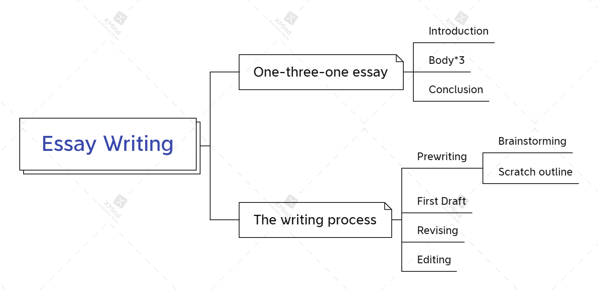
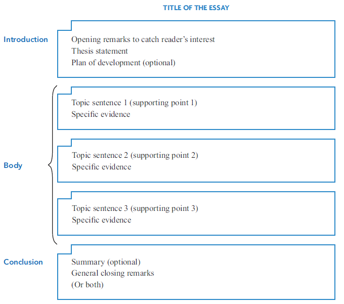

# College Writing Skills With Readings Notes

## Part One: Essay Writing

### 1. An Introduction to Writing

- In writing, **any idea that you advance must be supported with specific reasons or details**.
- A **paragraph** is a short paper of around 150 to 200 words. It usually consists of an opening point called a **topic sentence** followed by a series of sentences which support that point.
- Writing a traditional essay make you a better writer and a stronger thinker. The discipline of writing an essay will strengthen your skills as a reader and listener.
- Writing is a process of discovery.

#### one-three-one essay, a standard college essay

### 2. The Writing Process

#### Prewriting

- **Freewriting**
  - jotting down in rough sentences or phrases everything that comes to mind about a possible topic
  - freewriting will limber up your writing muscles and make you familiar with the act of writing
- **Questioning**
  - generate ideas and details by asking questions about your subject. ***[Why? When? Where? Who? How?]***
- **Making a List (Brainstorming)**
  - collect ideas and details that relate to your subject
- **Clustering (Diagramming or mapping)**
  - use lines, boxes, arrows, and circles to show relationships among the ideas and details that occur to you ***(like Mind map)***
- **Preparing a Scratch Outline**
  - an excellent sequel to the above techniques
  - think carefully about the ***point*** you are making, the ***supporting items*** for that point and the ***order*** in which you will arrange those items.

#### Writing a First Draft

- **Goal**
  - state your ***thesis*** clearly
  - develop the ***content*** of your paper with plenty of specific details
- **Tips**
  - be prepared to put in additional thoughts and details that did not emerge during prewriting
  - if you hit a snag, just leave a blank space or "Do later" comment and press on to finish the paper
  - don't worry yet about grammar, punctuation or spelling

#### Revising

- **Hints**

  - ***set your first draft aside for a while***, from few hours to days, to get a more objective point of view
  - ***work from typed or printed text*** to see the paper more impartially
  - ***read your draft aloud***
  - add your thoughts and changes ***above the lines or in the margins*** of your paper

>  Revising process: Revising content --> Revising sentences --> Editing

- **Revising content**
  1. Is my essay **unified** ?
  • Do I have a thesis that is ***clearly stated or implied in the introductory paragraph*** of my essay?
  • Do all my ***supporting paragraphs*** truly support and back up my thesis?
  2. Is my essay **supported** ?
  • Are there ***three separate supporting points*** for the thesis?
  • Do I have ***specific evidence*** for each of the three supporting points?
  • Is there ***plenty of specific evidence*** for each supporting point?
  3. Is my essay **organized** ?
  • Do I have an ***interesting introduction***, a ***solid conclusion***, and an ***accurate title***?
  • Do I have ***a clear method of organizing my essay***?
  • Do I use ***transitions*** and other ***connecting words***?
  
- **Revising sentences**

  1. Do I use ***parallelism*** to balance my words and ideas?
  2. Do I have a ***consistent point of view***?
  3. Do I use ***specific words***?
  4. Do I use ***active verbs***?
  5. Do I use words ***effectively*** by avoiding slang, clichés, pretentious language, and wordiness?
  6. Do I ***vary*** my sentences?

#### Editing

- check for and correct errors in **grammar**, **punctuation** and **spelling**

### 3. The First and Second Steps in Essay Writing

### 4. The Third Step in Essay Writing

### 5. The Fourth Step in Essay Writing

### 6. Four Bases for Revising Essays

